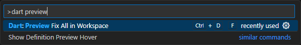

# iNoWa Spielwiese

Projekt zum Erlernen von Flutter auf Basis des Beispielprojekts der [flutter_reactive_ble](https://github.com/PhilipsHue/flutter_reactive_ble) Bibliothek.

## Git Clone

Nach dem klonen des Projekts müssen folgende Befehle ausgeführt werden:

- `flutter pub get`
- `flutter gen-l10n `

## Anpassungen

Zum Zeitpunkt Übertragung des Projekts nach GitHub waren bereits folgende Änderungen getan.

### Fehlerkorrekturen

- `LateInitializationError` nach der Auswahl eines Gerätes und Rückkehr zur Geräteliste ohne das Gerät verbunden zu haben.
- Characteristics Kacheln ließen sich nicht aufklappen.
- `LateInitializationError` nach dem Öffnen des **Select an operation** Dialogs.

### Änderungen

- Filtern gefundener Geräte nach einem generischen Gerätenamen, zum Beispiel: **iNoWa\***
- Automatischer Start des Scanvorgangs beim Öffnen der App.
- Automatisches Verbinden mit dem **iNoWa** Peripheral Gerät, insofern es gefunden worden ist.
- Senden von Text (Boulder Zügen) anstelle von Integer Werten an das Peripheral.

### Adafruit NeoPixel

Der Arduino Giga R1 wird von der Adafruit NeoPixel Bibliothek (noch) nicht nativ unterstützt. Es gibt aber einen [Pull Request](https://github.com/adafruit/Adafruit_NeoPixel/pull/407), der genau diese Unterstützung bringt.

Siehe: [Adafruit NeoPixel für Giga R1](https://github.com/Haschtl/Adafruit_NeoPixel/tree/master)

### Bluetooth LE

Bluetooth LE wird mit Hilfe der [flutter_reactive_ble](https://pub.dev/packages/flutter_reactive_ble) Bibliothek eingebunden.

Einbinden der Bibliothek:

```bash
dart pub global activate melos
melos bootstrap
flutter pub add flutter_reactive_ble
```
<details>
<summary>Bluetooth Berechtigungen für Android</summary>

Die Berechtigungen werden in der Datei `[project_home]\android\app\src\main\AndroidManifest.xml` abgelegt:

<manifest xmlns:android="http://schemas.android.com/apk/res/android">

```xml
    <uses-feature android:name="android.hardware.bluetooth_le" android:required="true" />
    <uses-permission android:name="android.permission.BLUETOOTH_SCAN" />
    <uses-permission android:name="android.permission.BLUETOOTH_CONNECT" />
    <!-- location permission is not required
    <uses-permission android:name="android.permission.ACCESS_FINE_LOCATION" android:maxSdkVersion="30" />
    <uses-permission android:name="android.permission.ACCESS_COARSE_LOCATION" android:maxSdkVersion="30" />
     -->

    <application>
    ...
    </application>
</manifest>
```

</details>

<details>
<summary>Bluetooth Berechtigungen für iOS</summary>

Die Berechtigungen werden in der Datei `[project_home]\android\app\src\main\AndroidManifest.xml` abgelegt:

<manifest xmlns:android="http://schemas.android.com/apk/res/android">

```xml
<?xml version="1.0" encoding="UTF-8"?>
<!DOCTYPE plist PUBLIC "-//Apple//DTD PLIST 1.0//EN" "http://www.apple.com/DTDs/PropertyList-1.0.dtd">
<plist version="1.0">
    <dict>
        <!-- iOS13 and higher -->
        <key>NSBluetoothAlwaysUsageDescription</key>
        <string>This app needs access to Bluetooth to function properly.</string>
        <!-- iOS12 and lower -->
        <key>NSBluetoothPeripheralUsageDescription</key>
        <string>This app needs access to Bluetooth to function properly.</string>
        ```
    </dict>
</plist>
```

</details>
<p>

## Hinzufügen / Entfernen von Pattformen

Hinzufügen: `flutter create --platform ios .`

Aktivieren: `flutter config --enable-ios`

Deaktivieren: `flutter config --no-enable-ios`

Entfernen: Löschen des entsprechenden Ordners.

## Bibliotheken

- [Flutter Bluetooth Library](https://pub.dev/packages/flutter_reactive_ble)
- [Rename App](https://pub.dev/packages/rename_app)

## Umbenennen der App

Einbinden der Dependency:

```yaml
dev_dependencies:
  rename_app: any
```

Umbenenen der App mit:

```dart
dart run rename_app:main all="iNoWa"
```

## Internationalisierung

Siehe hierzu: [Internationalizing Flutter apps](https://docs.flutter.dev/ui/accessibility-and-internationalization/internationalization)

Vorbereitung der App:

```bash
flutter pub add flutter_localizations --sdk=flutter
flutter pub add intl:any
```

Der Befehl `flutter gen-l10n` nach jeder Änderung einer Sprachkonstanten ausgeführt werden:

- app_en.arb (Default Sprache)
- app_de.arb

Verwenden der Sprachkonstanten:

```dart
title: Text(AppLocalizations.of(context)!.helloWorld),
```

## Erstellen einer .apk Datei

Bauen der `.aab` Datei im Zielordner `[project_home]\build\app\outputs\bundle\release\`:

```bash
flutter build appbundle
```

Bauen der `.apk` Datei im Zielordner `[project_home]\build\app\outputs\flutter-apk\`:

```bash
flutter build apk --split-per-abi
```

Zielordner: `[project_home]\build\app\outputs\flutter-apk\`

## Firebase

- [Firebase Konsole](https://console.firebase.google.com/project/inowa-923ad/overview?hl=de)

## Dart

Der Befehl `dart analyze` analysiert das Projekt und erstellt eine Liste mit Vorschägen
zur Verbesserung des Codes. Der Befehl wird beim Starten von VSCode automatisch ausgeführt
und auf Nachfrage eine View mit den vorgeschlagenen Änderungen angezeigt.

Während der Entwicklung kann der Befehl jederzeit ausgeführt werden. Die View mit den
vorgeschlagenen Änderungen kann wie folgt geöffnet werden:



## VSCode Erweiterungen

- [Dart](https://marketplace.visualstudio.com/items?itemName=Dart-Code.dart-code)
- [Dart Import Sorter](https://marketplace.visualstudio.com/items?itemName=aziznal.dart-import-sorter)
- [Flutter](https://marketplace.visualstudio.com/items?itemName=Dart-Code.flutter)
- [TODO Tree](https://marketplace.visualstudio.com/items?itemName=Gruntfuggly.todo-tree)
- [Git History](https://marketplace.visualstudio.com/items?itemName=donjayamanne.githistory)
- [Git Open Diff](https://marketplace.visualstudio.com/items?itemName=kappariver.git-open-diff)
- [GitLens - Git superchared](https://marketplace.visualstudio.com/items?itemName=eamodio.gitlens)

Gitlens erfordert eine Freigabe für GitHub um verschiedene Informationen anzeigen zu können.

## Bildschirm Designer

- [FlutterViz](https://flutterviz.com/)

## Interessante Plugins

- [get 4.6.6, Navigation without context](https://pub.dev/packages/get)

## Dokumentation

- [Dart Richtlinien](https://dart.dev/effective-dart/style)
- [The right way to create a Flutter project](https://themobilecoder.com/the-right-way-to-create-a-flutter-project/)
- [Working with locales](https://stackoverflow.com/questions/50923906/how-to-get-timezone-language-and-county-id-in-flutter-by-the-location-of-device)
- [Flutter Templates](https://www.fluttertemplates.dev/widgets/must_haves/)
- [Manage TODO List in VSCode](https://medium.com/@EclecticCoder/manage-todo-list-in-vscode-beb53774d776)
